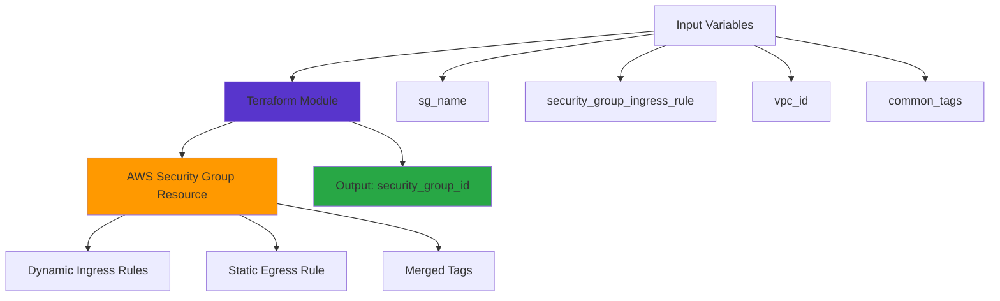

# 🚀 AWS Security Group Terraform Module

*Building secure, scalable infrastructure one module at a time*


A reusable Terraform module that creates AWS Security Groups with dynamic ingress rules, following infrastructure-as-code best practices for maximum flexibility and maintainability.

## 🎯 The "Why" - Problem & Purpose

Security Groups are the backbone of AWS network security, but managing them across multiple environments often leads to code duplication and configuration drift. Traditional approaches require writing repetitive Terraform code for each security group, making it difficult to maintain consistency across projects.

**Why I built this:** I wanted to create a modular, DRY (Don't Repeat Yourself) approach to security group management that could handle complex ingress rule configurations while maintaining clean, readable code. This module eliminates the need to write security group resources repeatedly and ensures consistent tagging and naming conventions across all environments.

## 🛠️ Tech Stack & Architecture

**Core Technologies:**
- **Terraform** - Infrastructure as Code provisioning
- **AWS Provider** - Cloud resource management
- **HCL (HashiCorp Configuration Language)** - Configuration syntax
- **Dynamic Blocks** - Advanced Terraform features for flexible configurations



## 🚀 Getting Started

### Prerequisites
- Terraform >= 0.14
- AWS CLI configured with appropriate credentials
- An existing VPC where the security group will be created

### Installation & Usage

1. **Clone or reference this module:**
```bash
git clone <repository-url>
cd terraform-aws-security-group-module
```

2. **Use the module in your Terraform configuration:**
```hcl
module "web_security_group" {
  source = "./path-to-this-module"
  
  sg_name        = "web-server-sg"
  sg_description = "Security group for web servers"
  vpc_id         = "vpc-xxxxxxxxx"
  project_name   = "my-project"
  
  common_tags = {
    Environment = "production"
    Team        = "devops"
  }
  
  security_group_ingress_rule = [
    {
      description = "HTTP access"
      from_port   = 80
      to_port     = 80
      protocol    = "tcp"
      cidr_blocks = ["0.0.0.0/0"]
    },
    {
      description = "HTTPS access"
      from_port   = 443
      to_port     = 443
      protocol    = "tcp"
      cidr_blocks = ["0.0.0.0/0"]
    },
    {
      description = "SSH access"
      from_port   = 22
      to_port     = 22
      protocol    = "tcp"
      cidr_blocks = ["10.0.0.0/8"]
    }
  ]
  
  sg_tags = {
    Purpose = "web-tier"
  }
}
```

3. **Initialize and apply:**
```bash
terraform init
terraform plan
terraform apply
```

4. **Access the security group ID:**
```hcl
output "sg_id" {
  value = module.web_security_group.security_group_id
}
```

## 📚 My Learning Journey & Key Takeaways

**Challenge Faced:** Initially, I struggled with making the ingress rules truly dynamic. My first approach used separate resources for each rule, which wasn't scalable and violated DRY principles.

**Solution Discovered:** I implemented Terraform's `dynamic` blocks with `for_each` to iterate over a list of ingress rule objects. This pattern allows users to define any number of ingress rules as structured data, making the module incredibly flexible.

**Key Concepts Learned:**
- **Dynamic Blocks in Terraform:** Understanding how `for_each` and `dynamic` work together to create flexible, reusable infrastructure code
- **Variable Structure Design:** Learning to design complex variable structures that balance flexibility with usability
- **Tag Merging Strategy:** Implementing a three-tier tagging approach (common tags + auto-generated name tag + specific tags) for consistent resource organization
- **Module Output Patterns:** Designing clean interfaces between modules using strategic outputs

This project deepened my understanding of advanced Terraform concepts and reinforced the importance of creating truly reusable infrastructure components.
